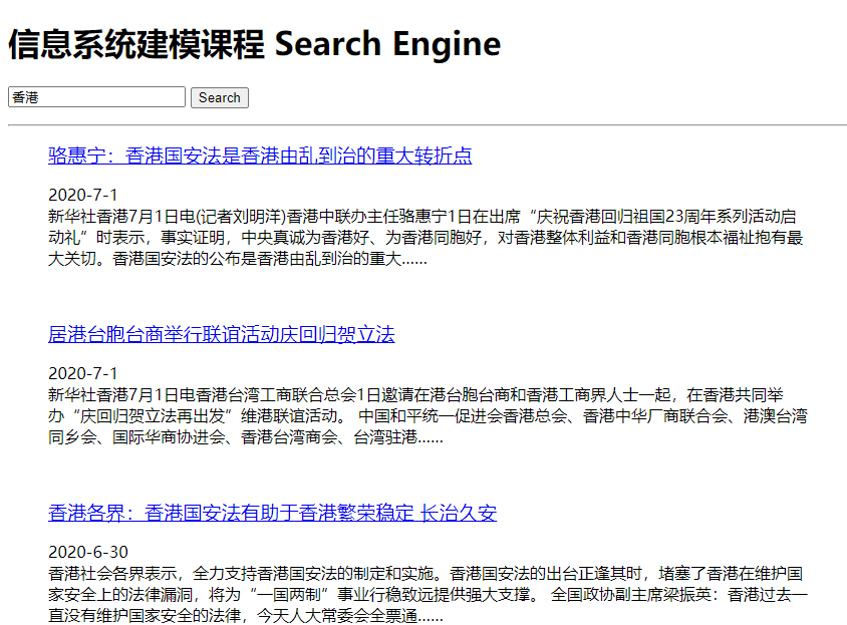

# 新闻搜索引擎

# 使用方法
1. 安装python 3.4+环境（推荐[Anaconda](https://www.anaconda.com/distribution/)或[Miniconda](https://docs.conda.io/en/latest/miniconda.html)）
2. 安装lxml html解析器，命令为`pip install lxml`
3. 安装jieba分词组件，命令为`pip install jieba`
4. 安装Flask Web框架，命令为`pip install Flask`
5. 进入web文件夹，运行main.py文件
6. 打开浏览器，访问http://127.0.0.1:5000/ 输入关键词开始测试

如果想抓取最新新闻数据并构建索引：

1. 运行爬虫`./code/spider.chinanews.com.py`爬取中国新闻网最近5天新闻；运行爬虫`./code/spider.news.xjtu.edu.cn.py`爬取交大新闻网中下新闻。
2. 运行`./code/setup.py自动构建索引`
3. 运行`./web/main.py`文件，或者执行`./web/run shell.txt`中的命令（网页模板`./web/templates`有修改时）
4. 打开浏览器，访问http://127.0.0.1:5000/ 输入关键词开始测试

**本项目为信息系统建模的一个小作业，感谢原作者提供的代码和文档。**

# 项目介绍
1. [和我一起构建搜索引擎（一）简介](http://bitjoy.net/2016/01/04/introduction-to-building-a-search-engine-1/)
2. [和我一起构建搜索引擎（二）网络爬虫](http://bitjoy.net/2016/01/04/introduction-to-building-a-search-engine-2/)
3. [和我一起构建搜索引擎（三）构建索引](http://bitjoy.net/2016/01/07/introduction-to-building-a-search-engine-3/)
4. [和我一起构建搜索引擎（四）检索模型](http://bitjoy.net/2016/01/07/introduction-to-building-a-search-engine-4/)
5. [和我一起构建搜索引擎（五）推荐阅读](http://bitjoy.net/2016/01/09/introduction-to-building-a-search-engine-5/)
6. [和我一起构建搜索引擎（六）系统展示](http://bitjoy.net/2016/01/09/introduction-to-building-a-search-engine-6/)
7. [和我一起构建搜索引擎（七）总结展望](http://bitjoy.net/2016/01/09/introduction-to-building-a-search-engine-7/)
8. [和我一起构建搜索引擎（八）更新爬虫&修改打分&线上部署](https://bitjoy.net/2020/04/05/introduction-to-building-a-search-engine-8//)

# 感谢
* [jieba](https://github.com/fxsjy/jieba)
* [scikit-learn](https://github.com/scikit-learn/scikit-learn)
* [flask](https://github.com/mitsuhiko/flask)